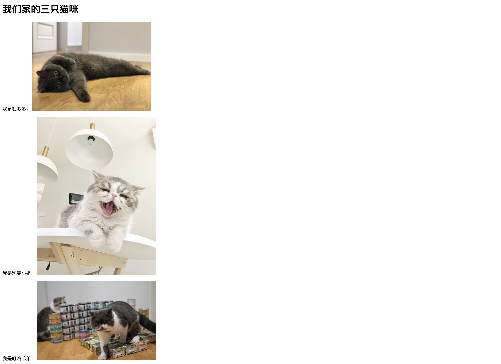

# 两周历程：学习前端知识
通过这篇文章，我将记录自己在2018年剩下两周左右的时间内，系统的、强化的学习两周的Javascript，弥补技术栈中最薄弱的前端知识。

### 小目标：

目前我的技术栈主要在：golang、python方面，对于前端知识知之甚少，所以希望通过这个项目，让自己通过两周的学习，学习部分前端知识，能够做出一个较好的展示页面出来。

### 工程展示

代码库：

- https://github.com/xpzouying/learning_fontend

#### 目前的基础

第一个项目的demo

仅仅使用了最最基本的HTML创作。

